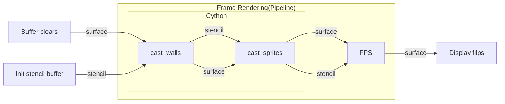

# Pooma

Ray marching graphics library.

Из-за того, что в текстуре спрайта могут быть дырки(и выступы по бокам), за которыми 1D stencil buffer откинет текстуры,
мы вынуждены рендерить все. Каждый этап рисует свою картинку независимо, после чего картинка силивается через буффер
глубин. Буффер глубины не решит проблему с дырками, если сначала рисовть спрайты, а затем - стены.

2D stencil buffer может быть слишком ресурсоемким решением даже для Cython кода. Нужно будет проходить > 2*10^6 px за
1/16s + затраты на отправку на GPU, обновление физики, AI, etc.

